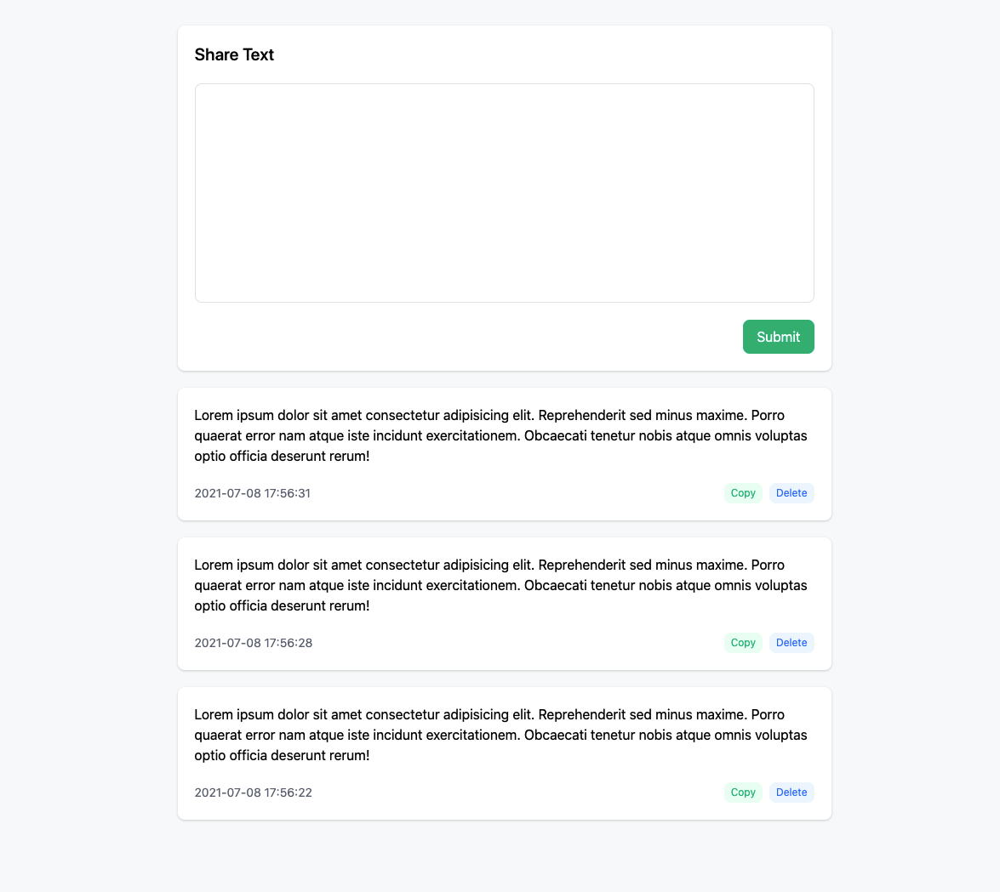
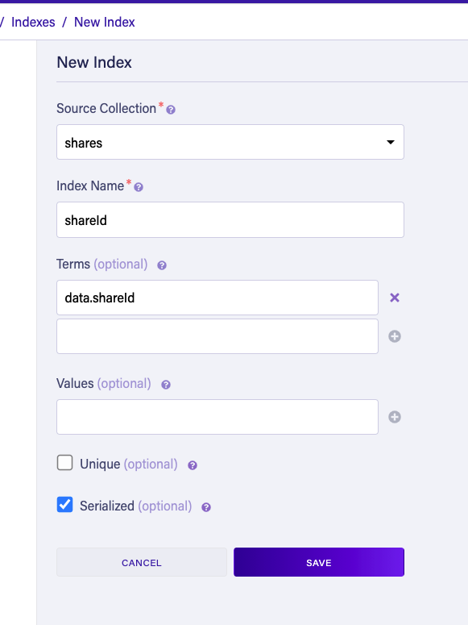

# text share

> Simple multi-device text sharing

<p align="center">
  
</p>

## Deploy your own

### 1. setup [fauna db](https://fauna.com)

- create database and collection
- create index for `shareId`



### 2. deploy to [Vercel](https://vercel.com)

Environment Variables

```env
# your faunadb collection secret
FAUNADB_SECRET=
# white list for shareIds, separated by commas
SHARES_WHITELIST=
# faunadb collection name
FAUNADB_COLLECTION=
# shareId index name
FAUNADB_SHARE_ID_INDEX=
```
